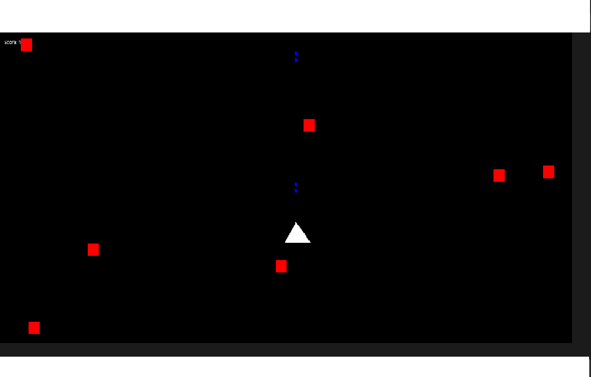

# Proyecto Unidad III y Unidad IV OOP
## Juego en JavaScript

El objetivo del proyecto es crear un videojuego en javascript que fuera divertido y utilice el tema de Polimorfismo y herencia.
El videojuego consiste en contolar una nave que dispara a enemigos.
El videojuego utiliza la librería p5.js para crear gráficos interactivos. También incorpora elementos como puntaje y un jefe secreto. 
A continuación les voy a mostrar algunas capturas de pantalla del videojuego.

## Diagrama UML

